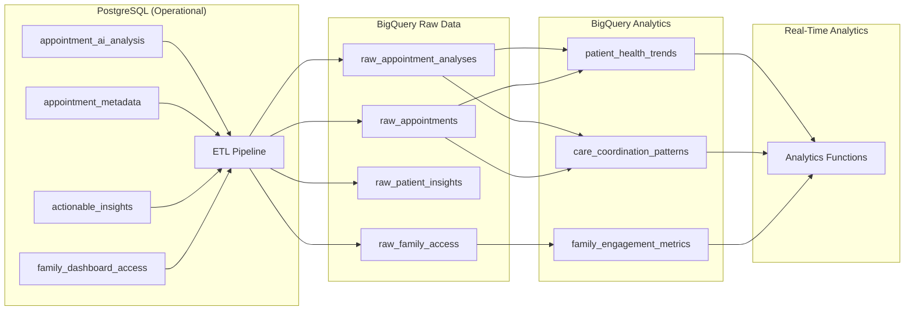

# Moira Healthcare - BigQuery Analytics Data Warehouse ERD

## Entity Relationship Diagram - Analytics Warehouse

```mermaid
erDiagram
    %% Patient Health Analytics Tables
    patient_health_trends {
        STRING patient_id PK "Partitioned by analysis_date"
        DATE analysis_date PK "Analysis date partition"
        STRING health_trend_direction "improving|stable|declining"
        FLOAT64 severity_score_avg "Average severity across appointments"
        INT64 emergency_episodes_count "Count of emergency-level episodes"
        INT64 total_appointments "All appointments in period"
        INT64 internal_appointments "Your practice appointments"
        INT64 external_appointments "External specialist appointments"
        FLOAT64 appointment_frequency_days "Average days between appointments"
        FLOAT64 coordination_effectiveness_score "Care coordination quality"
        INT64 active_care_coordination_items "Open coordination tasks"
        INT64 provider_network_diversity "Unique providers seen"
        FLOAT64 care_fragmentation_risk_score "Risk of fragmented care"
        INT64 medication_changes_count "Medication adjustments"
        INT64 potential_drug_interactions "Detected interactions"
        FLOAT64 medication_adherence_score "Adherence estimation"
        INT64 family_members_active "Active family dashboard users"
        FLOAT64 family_notification_engagement_rate "Family response rate"
        FLOAT64 caregiver_burden_assessment_score "Caregiver stress level"
        FLOAT64 healthkit_data_completeness "Wearable data quality"
        FLOAT64 appointment_recording_quality_avg "Audio quality average"
        FLOAT64 ai_analysis_confidence_avg "AI confidence average"
        FLOAT64 health_risk_score "Predictive health risk"
        INT64 care_gap_count "Identified care gaps"
        FLOAT64 predicted_next_episode_risk "Next emergency risk"
        TIMESTAMP analysis_timestamp "When analysis was run"
        FLOAT64 data_freshness_hours "How fresh the data is"
        STRING bigquery_processing_version "Analytics version"
    }

    care_coordination_patterns {
        STRING patient_id PK "Patient identifier"
        DATE analysis_period_start PK "Analysis period start"
        DATE analysis_period_end "Analysis period end"
        INT64 internal_providers_count "Your practice providers"
        INT64 external_providers_count "External specialists"
        ARRAY_STRING provider_specialties "List of provider specialties"
        FLOAT64 provider_communication_effectiveness "Communication quality"
        INT64 coordination_events_total "Total coordination events"
        INT64 coordination_events_resolved "Resolved coordination events"
        FLOAT64 avg_resolution_time_hours "Average resolution time"
        INT64 urgent_coordination_events "Emergency coordination events"
        FLOAT64 treatment_plan_coherence_score "Treatment consistency"
        FLOAT64 medication_management_alignment "Med management alignment"
        INT64 care_plan_conflicts_count "Conflicting care plans"
        INT64 provider_to_provider_gaps "Communication gaps"
        INT64 patient_information_sharing_gaps "Info sharing gaps"
        INT64 delayed_communication_events "Delayed communications"
        INT64 duplicate_care_events "Duplicate services"
        INT64 missed_follow_up_opportunities "Missed follow-ups"
        INT64 preventive_care_opportunities "Preventive care gaps"
        FLOAT64 emergency_coordination_preparedness "Emergency readiness"
        FLOAT64 care_transition_risk_score "Transition risk"
        TIMESTAMP analysis_timestamp "Analysis timestamp"
    }

    family_engagement_metrics {
        STRING patient_id PK "Patient being monitored"
        STRING family_member_access_id PK "Family member ID"
        STRING relationship "Family relationship type"
        DATE analysis_date PK "Analysis date partition"
        INT64 dashboard_views_count "Dashboard view count"
        INT64 notification_interactions_count "Notification interactions"
        FLOAT64 urgent_alert_response_time_minutes "Emergency response time"
        FLOAT64 urgent_alert_response_rate "Emergency response rate"
        FLOAT64 caregiver_burden_score "Caregiver stress assessment"
        FLOAT64 family_coordination_effectiveness "Family coordination quality"
        FLOAT64 caregiver_advocacy_score "Advocacy effectiveness"
        STRING optimal_notification_frequency "immediate|daily|weekly"
        ARRAY_STRING preferred_communication_times "Preferred contact times"
        STRING engagement_pattern_type "reactive|proactive|monitoring"
        FLOAT64 predicted_caregiver_availability "Availability prediction"
        FLOAT64 caregiver_burnout_risk_score "Burnout risk assessment"
        FLOAT64 support_network_strength "Support network quality"
        FLOAT64 family_engagement_patient_outcome_correlation "Outcome correlation"
        FLOAT64 care_adherence_improvement_with_family "Adherence improvement"
        TIMESTAMP analysis_timestamp "Analysis timestamp"
    }

    %% Raw Data Tables (ETL Source)
    raw_appointment_analyses {
        STRING analysis_id PK "Analysis unique ID"
        STRING patient_id "Patient identifier"
        STRING healthie_appointment_id "Appointment ID from Healthie"
        TIMESTAMP analysis_completed_at "When analysis completed"
        JSON emergency_flags "Emergency detection results"
        FLOAT64 overall_confidence_score "AI analysis confidence"
        STRING urgency_level "routine|priority|urgent|emergent"
        JSON clinical_findings "Structured clinical data"
        JSON care_coordination_needs "Coordination requirements"
        JSON ai_models_used "AI processing metadata"
        TIMESTAMP created_at "Record creation time"
    }

    raw_appointments {
        STRING healthie_appointment_id PK "Appointment ID from Healthie"
        STRING patient_id "Patient identifier"
        BOOLEAN is_internal_appointment "Internal vs external"
        STRING appointment_category "Appointment type"
        STRING external_provider_name "External provider name"
        STRING external_provider_specialty "Provider specialty"
        STRING recording_method "Recording type"
        STRING appointment_status "Current appointment status"
        STRING analysis_status "Analysis processing status"
        TIMESTAMP created_at "Appointment created"
        TIMESTAMP updated_at "Last updated"
    }

    raw_patient_insights {
        STRING insight_id PK "Insight unique ID"
        STRING patient_user_id "Patient identifier"
        STRING source_appointment_id "Source appointment"
        STRING insight_type "Type of insight"
        STRING priority_level "low|medium|high|urgent"
        FLOAT64 urgency_score "Urgency rating"
        BOOLEAN patient_viewed "Patient has seen"
        BOOLEAN patient_acknowledged "Patient acknowledged"
        TIMESTAMP expires_at "Expiration time"
        TIMESTAMP resolved_at "Resolution time"
        TIMESTAMP created_at "Insight created"
    }

    raw_family_access {
        STRING access_id PK "Access unique ID"
        STRING patient_user_id "Patient being monitored"
        STRING family_member_email "Family member email"
        STRING relationship "Family relationship"
        STRING access_status "Access status"
        BOOLEAN can_receive_urgent_notifications "Urgent alert permission"
        TIMESTAMP invitation_accepted_at "When invitation accepted"
        TIMESTAMP created_at "Access record created"
    }

    raw_family_notifications {
        STRING notification_id PK "Notification unique ID"
        STRING family_access_id "Family access record"
        STRING notification_type "Type of notification"
        TIMESTAMP sent_at "When notification sent"
        TIMESTAMP opened_at "When notification opened"
        TIMESTAMP created_at "Notification record created"
    }

    %% Analytics Function Views (Computed)
    analyze_patient_health_trends {
        STRING input_patient_id "Function input parameter"
        STRING health_trend_direction "Computed trend direction"
        FLOAT64 trend_confidence "Trend confidence level"
        FLOAT64 current_severity_avg "Current severity average"
        FLOAT64 severity_variance "Severity variance"
        INT64 appointments_analyzed "Number of appointments"
        INT64 emergency_episodes "Emergency episode count"
        STRING family_alert_level "urgent|attention|important|normal"
        TIMESTAMP analysis_timestamp "Function execution time"
    }

    analyze_care_coordination {
        STRING input_patient_id "Function input parameter"
        INT64 provider_network_diversity "Provider diversity count"
        FLOAT64 coordination_need_detection_rate "Detection rate"
        FLOAT64 coordination_action_rate "Action rate"
        FLOAT64 care_fragmentation_risk_score "Fragmentation risk"
        INT64 recent_coordination_events "Recent coordination count"
        TIMESTAMP analysis_timestamp "Function execution time"
    }

    analyze_family_intelligence {
        STRING input_patient_id "Function input parameter"
        INT64 active_family_members "Active family count"
        INT64 family_relationship_diversity "Relationship diversity"
        FLOAT64 avg_family_engagement_rate "Average engagement"
        STRING optimal_notification_frequency "Optimal frequency"
        FLOAT64 caregiver_burden_estimate "Caregiver burden"
        FLOAT64 family_coordination_effectiveness "Coordination effectiveness"
        TIMESTAMP analysis_timestamp "Function execution time"
    }

    %% Relationships - Data Flow
    raw_appointment_analyses ||--o{ patient_health_trends : "feeds into health analytics"
    raw_appointments ||--o{ patient_health_trends : "appointment data for trends"
    raw_appointment_analyses ||--o{ care_coordination_patterns : "coordination analysis"
    raw_appointments ||--o{ care_coordination_patterns : "appointment metadata"
    raw_family_access ||--o{ family_engagement_metrics : "family access data"
    raw_family_notifications ||--o{ family_engagement_metrics : "notification interactions"
    
    %% Function Dependencies
    raw_appointment_analyses ||--o{ analyze_patient_health_trends : "source data"
    raw_appointment_analyses ||--o{ analyze_care_coordination : "coordination analysis"
    raw_family_access ||--o{ analyze_family_intelligence : "family data"
    raw_family_notifications ||--o{ analyze_family_intelligence : "engagement data"

```



## BigQuery Analytics Architecture

### **📊 Analytics Tables (Partitioned & Clustered)**

#### **1. Patient Health Trends**
```sql
-- Partitioned by analysis_date, clustered by patient_id
-- Updated daily with rolling health analytics
PARTITION BY analysis_date
CLUSTER BY patient_id
```
**Purpose**: Comprehensive patient health trajectory analysis
**Key Metrics**: Health trends, emergency episodes, care coordination effectiveness
**Use Cases**: Patient dashboards, provider alerts, family notifications

#### **2. Care Coordination Patterns**  
```sql
-- Partitioned by analysis_period_start, clustered by patient_id
-- Analysis periods: weekly, monthly, quarterly
PARTITION BY analysis_period_start  
CLUSTER BY patient_id
```
**Purpose**: Multi-provider care coordination analysis
**Key Metrics**: Provider network diversity, communication effectiveness, care conflicts
**Use Cases**: Care team optimization, fragmentation risk assessment

#### **3. Family Engagement Metrics**
```sql
-- Partitioned by analysis_date, clustered by patient_id
-- Daily family engagement tracking
PARTITION BY analysis_date
CLUSTER BY patient_id
```
**Purpose**: Family caregiver engagement and burden analysis
**Key Metrics**: Dashboard usage, response times, caregiver burnout risk
**Use Cases**: Family dashboard optimization, caregiver support

### **⚡ Real-Time Analytics Functions**

#### **1. analyze_patient_health_trends(patient_id)**
```sql
-- Table-valued function for real-time patient analysis
-- Analyzes last 6 months of appointments
-- Returns: trend direction, severity scores, emergency risk
```

#### **2. analyze_care_coordination(patient_id)**
```sql
-- Care coordination effectiveness analysis
-- Analyzes provider network and communication patterns
-- Returns: coordination metrics, fragmentation risk
```

#### **3. analyze_family_intelligence(patient_id)**
```sql
-- Family engagement optimization analysis  
-- Analyzes notification patterns and response rates
-- Returns: optimal notification strategy, caregiver burden
```

## Data Pipeline Architecture

### **🔄 ETL Process: PostgreSQL → BigQuery**



### **⏰ Update Frequency**
- **Raw Data Sync**: Every 15 minutes (incremental)
- **Analytics Tables**: Daily batch processing  
- **Analytics Functions**: Real-time on-demand
- **Family Dashboards**: Real-time with 5-minute cache

## Key Analytics Use Cases

### **🚨 Emergency Detection & Family Alerts**
```sql
-- Trigger urgent family notifications
SELECT patient_id, family_alert_level, health_trend_direction
FROM `moira-healthcare.analytics.analyze_patient_health_trends`('patient-123')
WHERE family_alert_level IN ('urgent', 'attention');
```

### **🏥 Care Coordination Optimization**
```sql
-- Identify patients with high fragmentation risk
SELECT patient_id, care_fragmentation_risk_score, provider_network_diversity
FROM `moira-healthcare.analytics.care_coordination_patterns`
WHERE care_fragmentation_risk_score > 0.7
ORDER BY care_fragmentation_risk_score DESC;
```

### **👥 Family Dashboard Intelligence**
```sql
-- Optimize family notification timing
SELECT patient_id, optimal_notification_frequency, caregiver_burden_estimate
FROM `moira-healthcare.analytics.analyze_family_intelligence`('patient-123')
```

## Performance & Optimization

### **🔍 Query Optimization**
- **Partitioning**: Time-based partitioning for efficient date range queries
- **Clustering**: Patient-based clustering for patient-centric analytics  
- **Materialized Views**: Pre-computed aggregations for dashboards
- **Table Functions**: Parameterized analytics for real-time insights

### **💰 Cost Optimization**  
- **Partition Pruning**: Date-based queries only scan relevant partitions
- **Clustering**: Patient-based queries minimize data scanning
- **Incremental ETL**: Only sync changed data from PostgreSQL
- **Smart Caching**: Cache frequently accessed analytics results

### **📈 Scalability**
- **Horizontal Scaling**: BigQuery automatically scales compute
- **Storage Efficiency**: Columnar storage optimized for analytics
- **Concurrent Analytics**: Multiple analytics functions run in parallel
- **Stream Processing**: Real-time data ingestion for urgent alerts
