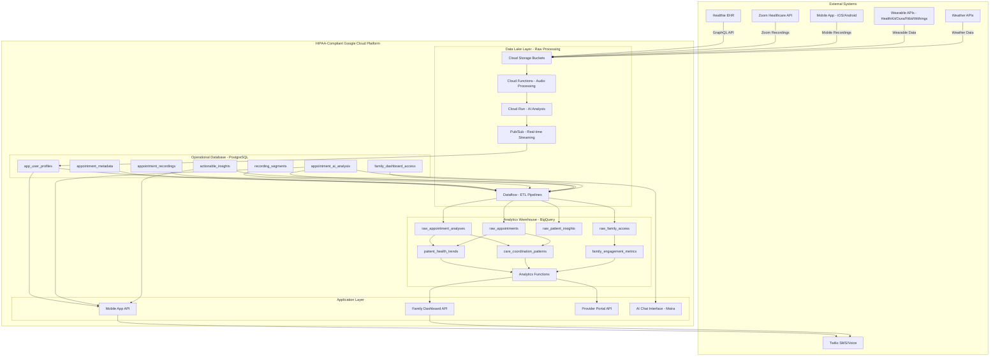
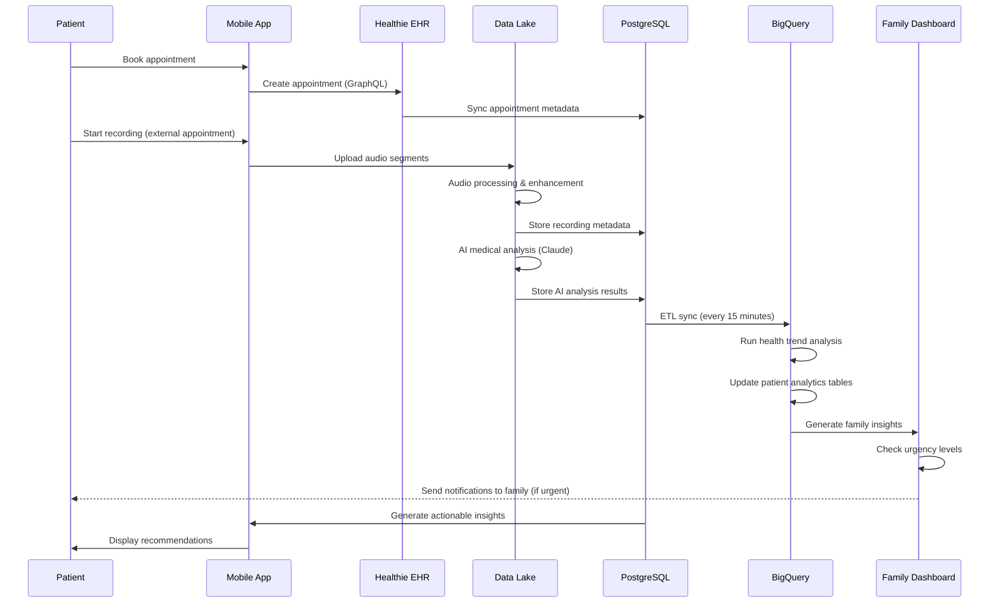

# Moira Healthcare - Complete Data Architecture Overview

## Comprehensive System Architecture Diagram

## Data Architecture Entity Relationships

### **🔄 Complete Data Flow Architecture**

```mermaid
erDiagram
    %% External System Entities
    HEALTHIE_EHR {
        string patient_id PK "Healthie patient ID"
        string appointment_id PK "Healthie appointment ID" 
        string provider_id "Provider ID (null for external)"
        enum contact_type "video_chat|in_person|external"
        json zoom_meeting_data "Zoom integration data"
        json clinical_notes "Provider clinical notes"
        timestamp created_at
    }
    
    ZOOM_RECORDINGS {
        string meeting_id PK "Zoom meeting ID"
        string download_url "Recording download URL"
        enum file_type "MP4|M4A|TRANSCRIPT"
        timestamp recording_start
        timestamp recording_end
        integer file_size_bytes
    }
    
    MOBILE_RECORDINGS {
        string recording_session_id PK "Mobile recording session"
        json recording_segments "Array of audio segments"
        json device_metadata "Device info and audio quality"
        timestamp started_at
        timestamp completed_at
    }
    
    WEARABLE_DATA {
        string device_id PK "Device identifier"
        string patient_id FK "Links to patient"
        enum data_type "heart_rate|steps|sleep|activity"
        json measurements "Time-series health data"
        timestamp measured_at
        timestamp synced_at
    }

    %% PostgreSQL Operational Database
    app_user_profiles {
        uuid user_id PK
        varchar healthie_patient_id UK "Links to Healthie EHR"
        boolean audio_recording_consent
        boolean ai_analysis_consent
        boolean family_sharing_consent
        boolean healthkit_authorized
        text[] authorized_data_types
        timestamp created_at
        timestamp updated_at
    }

    appointment_metadata {
        varchar healthie_appointment_id PK "Links to Healthie"
        boolean is_internal_appointment
        enum appointment_category "virtual_internal|in_person_internal|external_specialist"
        varchar external_provider_name
        varchar external_provider_specialty
        varchar external_facility_name
        enum recording_method "zoom_automatic|mobile_pause_resume"
        enum recording_status "not_started|recording|paused|completed|failed"
        enum appointment_status "scheduled|in_progress|completed|cancelled"
        enum analysis_status "pending|processing|completed|failed"
        timestamp created_at
        timestamp updated_at
    }

    appointment_recordings {
        uuid recording_id PK
        varchar healthie_appointment_id FK,UK
        enum recording_status
        uuid current_segment_id
        integer total_segments
        integer total_pause_duration_seconds
        varchar merged_audio_file_path
        integer merged_audio_duration_seconds
        decimal audio_quality_score
        timestamp recording_started_at
        timestamp recording_completed_at
        timestamp created_at
    }

    recording_segments {
        uuid segment_id PK
        uuid recording_id FK
        integer segment_number
        timestamp segment_start_time
        timestamp segment_end_time
        integer segment_duration_seconds
        varchar audio_file_path
        bigint audio_file_size_bytes
        jsonb audio_quality_metrics
        enum pause_reason "patient_request|privacy_sensitive|interruption|technical"
        integer pause_duration_seconds
        text resume_notes
        timestamp created_at
    }

    appointment_ai_analysis {
        uuid analysis_id PK
        varchar healthie_appointment_id FK
        uuid patient_id FK
        text clinical_summary
        jsonb clinical_findings
        jsonb diagnoses
        jsonb medications
        jsonb vital_signs
        jsonb emergency_flags
        enum urgency_level "routine|priority|urgent|emergent"
        jsonb care_coordination_needs
        jsonb provider_notifications
        jsonb patient_action_items
        jsonb ai_models_used
        decimal overall_confidence_score
        integer processing_time_seconds
        timestamp analysis_started_at
        timestamp analysis_completed_at
        timestamp created_at
    }

    actionable_insights {
        uuid insight_id PK
        uuid patient_user_id FK
        varchar source_appointment_id FK
        enum insight_type "medication_reminder|follow_up_needed|health_trend|care_coordination"
        varchar insight_title
        text insight_description
        text[] recommended_actions
        enum priority_level "low|medium|high|urgent"
        decimal urgency_score
        boolean patient_viewed
        boolean patient_acknowledged
        text[] patient_completed_actions
        timestamp expires_at
        timestamp resolved_at
        enum resolution_method "patient_action|provider_action|auto_resolved"
        timestamp created_at
        timestamp updated_at
    }

    family_dashboard_access {
        uuid access_id PK
        uuid patient_user_id FK
        varchar family_member_email
        varchar family_member_name
        enum relationship "spouse|parent|child|sibling|caregiver|guardian"
        enum access_level "view_only"
        enum access_status "invited|pending|active|suspended|revoked"
        boolean can_view_appointments
        boolean can_view_ai_summaries
        boolean can_view_actionable_insights
        boolean can_receive_urgent_notifications
        varchar invitation_token UK
        timestamp invitation_sent_at
        timestamp invitation_expires_at
        timestamp invitation_accepted_at
        timestamp created_at
        timestamp updated_at
    }

    %% BigQuery Analytics Warehouse
    patient_health_trends {
        string patient_id PK
        date analysis_date PK
        string health_trend_direction "improving|stable|declining"
        float64 severity_score_avg
        int64 emergency_episodes_count
        int64 total_appointments
        int64 internal_appointments
        int64 external_appointments
        float64 appointment_frequency_days
        float64 coordination_effectiveness_score
        int64 active_care_coordination_items
        int64 provider_network_diversity
        float64 care_fragmentation_risk_score
        int64 medication_changes_count
        int64 potential_drug_interactions
        float64 medication_adherence_score
        int64 family_members_active
        float64 family_notification_engagement_rate
        float64 caregiver_burden_assessment_score
        float64 healthkit_data_completeness
        float64 appointment_recording_quality_avg
        float64 ai_analysis_confidence_avg
        float64 health_risk_score
        int64 care_gap_count
        float64 predicted_next_episode_risk
        timestamp analysis_timestamp
        float64 data_freshness_hours
        string bigquery_processing_version
    }

    care_coordination_patterns {
        string patient_id PK
        date analysis_period_start PK
        date analysis_period_end
        int64 internal_providers_count
        int64 external_providers_count
        array_string provider_specialties
        float64 provider_communication_effectiveness
        int64 coordination_events_total
        int64 coordination_events_resolved
        float64 avg_resolution_time_hours
        int64 urgent_coordination_events
        float64 treatment_plan_coherence_score
        float64 medication_management_alignment
        int64 care_plan_conflicts_count
        int64 provider_to_provider_gaps
        int64 patient_information_sharing_gaps
        int64 delayed_communication_events
        int64 duplicate_care_events
        int64 missed_follow_up_opportunities
        int64 preventive_care_opportunities
        float64 emergency_coordination_preparedness
        float64 care_transition_risk_score
        timestamp analysis_timestamp
    }

    family_engagement_metrics {
        string patient_id PK
        string family_member_access_id PK
        string relationship
        date analysis_date PK
        int64 dashboard_views_count
        int64 notification_interactions_count
        float64 urgent_alert_response_time_minutes
        float64 urgent_alert_response_rate
        float64 caregiver_burden_score
        float64 family_coordination_effectiveness
        float64 caregiver_advocacy_score
        string optimal_notification_frequency "immediate|daily|weekly"
        array_string preferred_communication_times
        string engagement_pattern_type "reactive|proactive|monitoring"
        float64 predicted_caregiver_availability
        float64 caregiver_burnout_risk_score
        float64 support_network_strength
        float64 family_engagement_patient_outcome_correlation
        float64 care_adherence_improvement_with_family
        timestamp analysis_timestamp
    }

    %% System Relationships
    HEALTHIE_EHR ||--o{ appointment_metadata : "Healthie manages all appointments"
    ZOOM_RECORDINGS ||--o| appointment_recordings : "Zoom provides virtual recordings"
    MOBILE_RECORDINGS ||--o| appointment_recordings : "Mobile provides external recordings"
    WEARABLE_DATA ||--o{ patient_health_trends : "Wearables feed health analytics"
    
    app_user_profiles ||--o{ appointment_ai_analysis : "patient has analyses"
    app_user_profiles ||--o{ actionable_insights : "patient receives insights"
    app_user_profiles ||--o{ family_dashboard_access : "patient grants family access"
    app_user_profiles ||--o{ patient_health_trends : "patient health analytics"
    
    appointment_metadata ||--o| appointment_recordings : "appointment may have recording"
    appointment_metadata ||--o{ appointment_ai_analysis : "appointment analyzed by AI"
    appointment_metadata ||--o{ actionable_insights : "appointment generates insights"
    
    appointment_recordings ||--o{ recording_segments : "recording has segments"
    
    appointment_ai_analysis ||--o{ patient_health_trends : "AI analysis feeds trends"
    appointment_ai_analysis ||--o{ care_coordination_patterns : "Analysis drives coordination"
    
    family_dashboard_access ||--o{ family_engagement_metrics : "Family access drives engagement analytics"

```

## Complete Data Architecture Summary

### **🏗️ System Architecture Layers**

#### **1. External Data Sources**
- **Healthie EHR**: Single source of truth for all patient/appointment data
- **Zoom Healthcare API**: Automatic recording capture for virtual appointments
- **Mobile Apps**: Manual recording for external specialist appointments
- **Wearable APIs**: HealthKit, Oura, Fitbit, Withings health data
- **Weather APIs**: Location-based weather for health correlations
- **Twilio**: SMS/voice notifications for patients and family

#### **2. HIPAA-Compliant Cloud Data Lake** 
- **Cloud Storage**: Encrypted raw data storage (audio, transcripts, health data)
- **Cloud Functions**: Audio processing, enhancement, AI analysis triggers
- **Cloud Run**: Containerized AI analysis services (medical conversation analysis)
- **Pub/Sub**: Real-time streaming for urgent alerts and notifications
- **Dataflow**: ETL pipelines from operational DB to analytics warehouse

#### **3. PostgreSQL Operational Database**
- **Real-time operations**: User profiles, appointments, recordings, AI analysis
- **CRUD operations**: Mobile app functionality and provider workflows
- **Consent management**: Patient permissions for recording, AI, family access
- **Recording sessions**: Pause/resume mobile recording with full audit trail
- **AI analysis storage**: Clinical findings, emergency flags, action items
- **Family access control**: Granular permissions and invitation management

#### **4. BigQuery Analytics Warehouse**
- **Patient health trends**: Longitudinal health analysis and predictive modeling
- **Care coordination patterns**: Multi-provider care effectiveness analysis
- **Family engagement metrics**: Caregiver burden and engagement optimization
- **Real-time analytics functions**: On-demand patient insights for dashboards
- **Performance optimization**: Partitioned/clustered for fast patient-centric queries

#### **5. Application APIs**
- **Mobile App API**: Patient-facing functionality backed by PostgreSQL
- **Family Dashboard API**: View-only family access powered by BigQuery analytics
- **Provider Portal API**: Clinical insights and care coordination tools
- **AI Chat Interface (Moira)**: LLM chat backed by patient context and safety guardrails

### **🔄 Data Processing Pipeline**

### **📊 Key Data Relationships**

#### **Patient-Centric Design**
- Every table links back to `patient_id` (either directly or through appointments)
- Patient consent controls data processing and family access
- All analytics are computed per-patient with cross-patient aggregations for benchmarking

#### **Appointment-Centric Processing**
- Healthie EHR is the single source of truth for all appointments (internal AND external)
- Each appointment can have 0 or 1 recording session
- Each recording session can have multiple segments (pause/resume functionality)  
- Each appointment generates exactly 1 AI analysis result
- Each AI analysis can generate multiple actionable insights

#### **Family-Centric Analytics**
- Family members have granular view permissions set by patient
- Family analytics optimize notification timing and reduce caregiver burden
- Emergency detection triggers immediate family notifications
- Family engagement correlates with patient health outcomes

### **🔐 Security & Compliance Architecture**

#### **HIPAA Compliance**
- **Data Encryption**: All data encrypted at rest (AES-256) and in transit (TLS 1.3)
- **Access Controls**: Role-based permissions with audit trails
- **BAA Coverage**: Business Associate Agreements with all cloud providers
- **Data Minimization**: Family members only see data they're explicitly granted access to
- **Audit Logging**: All data access and modifications logged with timestamps

#### **Data Governance**  
- **Single Source of Truth**: Healthie EHR manages all canonical patient/appointment data
- **Data Lineage**: Clear tracking from raw recordings through AI analysis to patient insights
- **Consent Management**: Patient controls all data processing through explicit opt-in consent
- **Data Retention**: Configurable retention policies for recordings and analytics
- **Right to Erasure**: Patient data deletion cascades through all systems

### **⚡ Performance & Scalability**

#### **PostgreSQL Optimization**
- **Indexing**: Fast patient lookups, appointment status queries, timeline generation
- **Partitioning**: Large tables partitioned by date for efficient queries
- **Connection Pooling**: Optimized connection management for mobile app load
- **Read Replicas**: Separate read replicas for analytics ETL to reduce operational load

#### **BigQuery Optimization**  
- **Partitioning**: Time-based partitioning for efficient date range analytics
- **Clustering**: Patient-based clustering for fast patient-centric queries
- **Materialized Views**: Pre-computed aggregations for dashboard performance
- **Table Functions**: Parameterized analytics for real-time patient insights
- **Cost Control**: Partition pruning and query optimization minimize scanning costs

This comprehensive data architecture provides the foundation for all of your September objectives while maintaining HIPAA compliance, optimal performance, and clear data governance!
